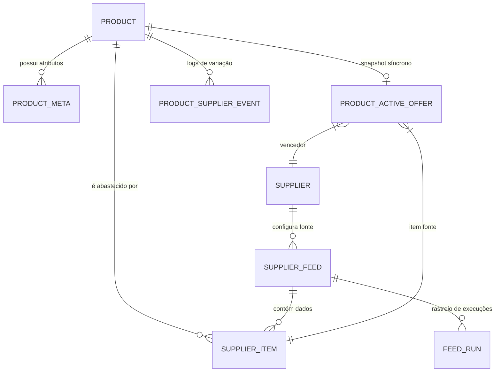
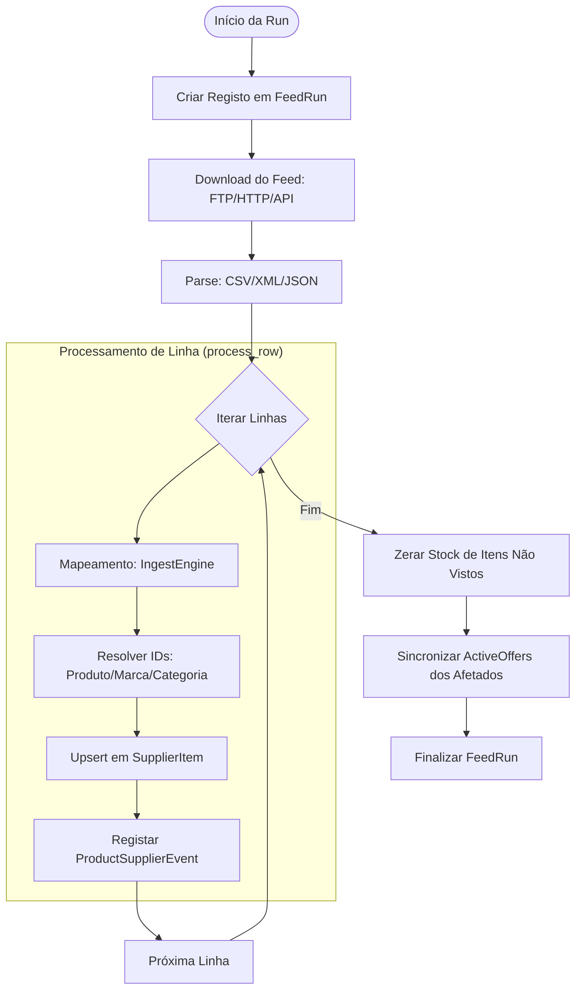
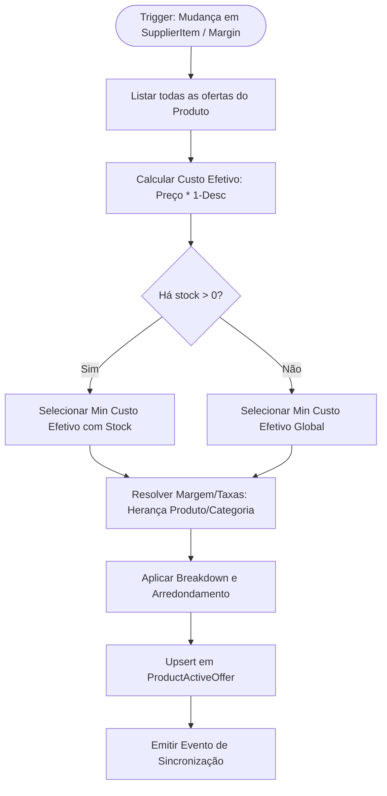
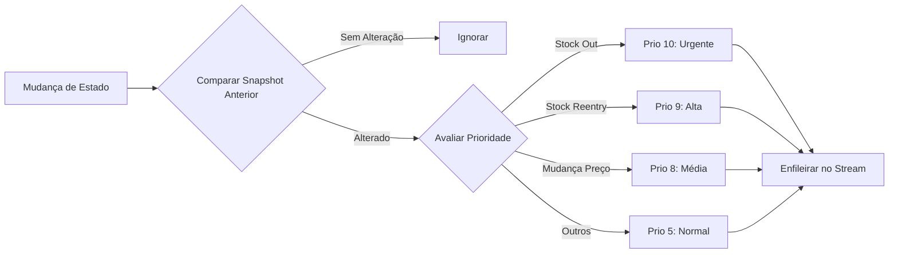
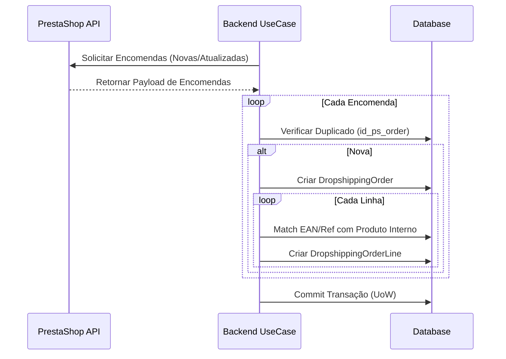
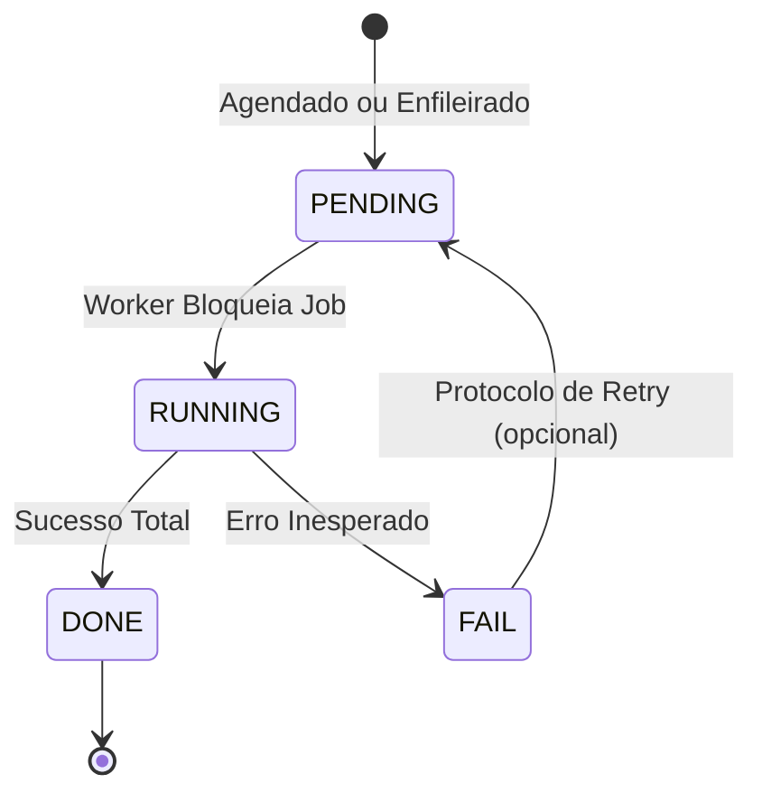

# Manual de Operações Genesys: Guia Técnico e Funcional Mestre

Este documento é o repositório central de conhecimento do ecossistema KS-Genesys. Consolida a arquitetura, regras de negócio granulares, fluxos de dados e protocolos operacionais para garantir a integridade da sincronização entre fornecedores e o ecommerce.

---

## 1. Arquitetura de Software e Padrões Core

O KS-Genesys utiliza uma arquitetura baseada em **FastAPI** e **SQLAlchemy**, estruturada em domínios de negócio para garantir escalabilidade e separação de preocupações.

### 1.1. Padrões de Implementação

- **CQRS (Command Query Responsibility Segregation):** Separação total entre leitura e escrita. Os `WriteRepositories` focam em mutações atómicas, enquanto os `ReadRepositories` otimizam a recuperação de dados para o frontend.
- **Unit of Work (UoW):** Orquestração de transações via `infra/uow.py`. Utiliza **Lazy Loading** para instanciar repositórios apenas quando necessários, reduzindo o overhead por request.
- **Injeção de Dependências:** Gestão de estados (Database sessions, Auth, Clients) via o sistema nativo do FastAPI.

---

## 2. Modelo de Dados e Relações (ER Diagram)

A estrutura de dados centraliza-se na entidade **Produto Canónico**, que reconcilia múltiplas ofertas externas.

---

## 3. Motor de Preços e Regras de Cálculo

O sistema garante que cada preço comunicado ao PrestaShop segue um conjunto rigoroso de leis matemáticas.

### 3.1. Regras de Taxas e Herança

As taxas (`margin`, `ecotax`, `extra_fees`) seguem um modelo de herança vertical:

| Nível         | Precedência | Comportamento                                           |
| :------------ | :---------- | :------------------------------------------------------ |
| **Produto**   | 1ª (Máxima) | Se definido no produto, ignora a categoria.             |
| **Categoria** | 2ª (Média)  | Usado se o produto estiver em branco (`NULL`).          |
| **Sistema**   | 3ª (Mínima) | Margem 0% ou Taxas 0€ se nenhum nível estiver definido. |

**Regra de Isenção Crítica:**

- Se o **País do Fornecedor** for **"PT"** (Portugal), o sistema força a **Ecotaxa a 0.00€**, independentemente das definições no Produto ou Categoria. Isto evita a dupla tributação de ecotax em produtos adquiridos internamente.

### 3.2. Algoritmo de Arredondamento Psicológico

O preço com IVA é sempre normalizado para evitar valores "não estéticos". O motor aplica regras diferenciadas com base no valor do produto:

#### A. Produtos com Preço < 5.00€ (Arredondamento sempre para CIMA)

Para itens de baixo custo, o sistema garante a margem arredondando sempre para o patamar superior:

- **Cêntimos $\le 0.40€ \rightarrow$** Arredonda para **Euros.40**.
- **Cêntimos entre $0.41€$ e $0.90€ \rightarrow$** Arredonda para **Euros.90**.
- **Cêntimos $> 0.90€ \rightarrow$** Arredonda para **(Euros + 1).40**.

#### B. Produtos com Preço $\ge$ 5.00€ (Arredondamento por PROXIMIDADE)

- **Cêntimos $\le 0.15€ \rightarrow$** Arredonda para **(Euros - 1).90**.
- **Cêntimos entre $0.16€$ e $0.65€ \rightarrow$** Arredonda para **Euros.40**.
- **Cêntimos $> 0.65€ \rightarrow$** Arredonda para **Euros.90**.

---

## 4. Domínio: Procurement e Mapper Automático

O Mapper (`IngestEngine`) é o componente que limpa e transforma os dados brutos dos feeds.

### 4.2. Ciclo de Vida de uma Run de Ingestão

O processo de ingestão é orquestrado pelo worker e segue o fluxo abaixo:

### 4.3. Imutabilidade de Atributos

O sistema segue uma política de "Primeiro Preenchimento". Uma vez que um campo canónico (Nome, Descrição, Imagem, GTIN, PartNumber) é preenchido pelo Ingest Engine ou via Importação Manual, ele **não é mais alterado** por ingestões subsequentes. A sincronização contínua foca-se exclusivamente em **Preço e Stock**.

---

## 5. Operações de Gestor (Merchant Actions)

Ações manuais que despoletam sincronizações imediatas via `CatalogUpdateStream`.

### 5.1. Recálculo da Oferta Ativa (Active Offer)

Processo que decide qual o fornecedor "vencedor" para o ecommerce após uma ação de gestor ou atualização de feed.

### 5.2. Ações que Geram Eventos PrestaShop

Como o frontend não permite edição de atributos (GTIN, Imagens, Descrições) após a importação, os eventos manuais restringem-se a mutações de preço/stock:

| Ação                      | Impacto Técnico                                                            | Razão do Evento  |
| :------------------------ | :------------------------------------------------------------------------- | :--------------- |
| **Importação Manual**     | Criação do produto no PS. Envia Nome, Descrição, Imagens e Oferta Inicial. | `initial_import` |
| **Criação em Massa**      | Importação iterativa de múltiplos produtos.                                | `bulk_import`    |
| **Atualização de Margem** | Recálculo total do preço final arredondado.                                | `margin_update`  |
| **Alteração de Taxas**    | Recálculo do Breakdown (Ecotax/Fees) e preço final.                        | `tax_update`     |

---

## 6. Domínio: Sincronização e Prioridades

O backend utiliza um sistema de prioridades para garantir que informações críticas chegam primeiro ao ecommerce.

### 6.1. Emissão de Eventos e Prioridades

Decide a urgência de uma atualização no ecommerce baseando-se na transição de estado.

### 6.2. Prioridades de Sincronização (1-10)

- **10 (Prio Máxima):** **Stock Out.** Se um produto ficar sem stock em todos os fornecedores, deve ser "escondido" no PS instantaneamente.
- **9 (Prio Alta):** **Back in Stock.** Quando um produto volta a estar disponível.
- **8 (Prio Média):** **Price Change.** Alterações de preço que afetem as margens.
- **5 (Prio Normal):** Outras atualizações de estado ou novos produtos.

---

## 7. Fluxo de Encomendas e Dropshipping

Quando uma encomenda entra no PrestaShop, o Genesys orquestra o aprovisionamento.

### 7.1. Fluxo de Importação e Matching

### 7.2. Estados da Encomenda (`OrderStatus`)

- **`PENDING`:** Aguarda decisão humana (selecionar fornecedor ou confirmar custo).
- **`ORDERED`:** O pedido foi enviado ao fornecedor (Sage/Email). Bloqueia edições comerciais na linha.
- **`COMPLETED`:** Recebida e processada. Arquivo histórico.

---

## 8. Sistemas de Background (Worker)

O Worker (`worker_main.py`) gere os ciclos autónomos do sistema.

### 8.1. Ciclo de Vida do Job

### 8.2. Jobs Principais

- **`supplier_ingest`:** Ciclo de captura de feeds (FTP/HTTP).
- **`product_eol_check`:** Monitoriza caducidade de ofertas. Se um produto não aparece em nenhum feed por X dias, é marcado como **EOL (End of Life)**.
- **`product_auto_import`:** Importa produtos "frescos" de categorias críticas para o ecommerce de forma automática.

---

## 9. Segurança e Auditoria

### 9.1. Auth & Logs

- **JWT:** Todos os comandos de escrita requerem um token válido de administrador.
- **AuditLog:** Regista o autor e o timestamp de todas as Ações de Gestor (ver Secção 5).
- **Product Events:** Histórico imutável de quando o fornecedor X mudou o stock ou preço do item Y.

---

**ESTADO DO DOCUMENTO:** CONSOLIDADO E FINALIZADO
**LOCALIZAÇÃO:** `Backend/docs/MANUAL_OPERACOES_GENESYS.md`
