# PrestaShop Product Import Feature

Implementar a funcionalidade de importação automática de produtos do Genesys para o PrestaShop, com mapeamento de categorias e sincronização de stock/preços.

## User Review Required

> [!IMPORTANT]
> **Worker de Auto-Import**: Proponho usar o worker existente com um novo `job_kind = "product_auto_import"` que corre 1-2x/dia. Alternativa: worker dedicado separado.

> [!WARNING]
> **Migração de BD**: Os novos campos no modelo `Category` e `Product` requerem migração. Como não há Alembic configurado, as colunas serão adicionadas manualmente ou via `create_db_and_tables()`.

---

## Proposed Changes

### Phase 0: EOL Feature (Time-Based)

> **Regra definida**: Um produto é EOL quando **nenhum fornecedor tem stock há mais de 6 meses**.

> **Decisão técnica**: Usar **índice parcial** na tabela `ProductSupplierEvent` em vez de campo desnormalizado. Se performance degradar, migrar para tabela de resumo.

---

#### [MODIFY] product_supplier_event.py

Adicionar índice parcial para queries de stock positivo:

```diff
  __table_args__ = (
      CheckConstraint("stock >= 0", name="ck_pse_stock_nonneg"),
      Index("ix_pse_product_created", "id_product", "created_at"),
      Index("ix_pse_supplier_product", "id_supplier", "id_product"),
      Index("ix_pse_gtin_created", "gtin", "created_at"),
+     # Índice parcial para EOL check - apenas eventos com stock > 0
+     Index(
+         "ix_pse_stock_positive",
+         "id_product",
+         "created_at",
+         postgresql_where=text("stock > 0"),
+     ),
  )
```

---

#### [NEW] mark_eol_products.py

UseCase para marcar produtos EOL via query nos eventos:

```python
from datetime import datetime, timedelta
from sqlalchemy import select, exists, and_

EOL_THRESHOLD_DAYS = 180  # 6 meses

def execute(uow: UoW) -> dict:
    """
    Marca is_eol = True em produtos que não têm nenhum
    evento com stock > 0 nos últimos 6 meses.
    """
    db = uow.db
    cutoff = datetime.utcnow() - timedelta(days=EOL_THRESHOLD_DAYS)

    # Subquery: existe evento com stock > 0 após cutoff?
    has_recent_stock = exists(
        select(ProductSupplierEvent.id).where(
            ProductSupplierEvent.id_product == Product.id,
            ProductSupplierEvent.stock > 0,
            ProductSupplierEvent.created_at >= cutoff,
        )
    )

    # Produtos candidatos a EOL
    products = db.scalars(
        select(Product).where(
            Product.is_eol == False,
            ~has_recent_stock,
        )
    ).all()

    marked = 0
    for p in products:
        p.is_eol = True
        marked += 1

    uow.commit()
    return {"marked_eol": marked}
```

---

#### [NEW] products_read_repo.py

Adicionar método para verificar último stock positivo:

```python
def get_last_stock_positive_at(self, id_product: int) -> datetime | None:
    """Retorna a data do último evento com stock > 0 para um produto."""
    result = self.db.scalar(
        select(ProductSupplierEvent.created_at)
        .where(
            ProductSupplierEvent.id_product == id_product,
            ProductSupplierEvent.stock > 0,
        )
        .order_by(ProductSupplierEvent.created_at.desc())
        .limit(1)
    )
    return result
```

---

#### [MODIFY] job_handlers.py

Adicionar novo job kind para EOL check:

```python
JOB_KIND_EOL_CHECK = "eol_check"

async def dispatch_job(job_kind: str, payload_json: str, uow: UoW):
    ...
    elif job_kind == JOB_KIND_EOL_CHECK:
        from app.domains.catalog.usecases.products import mark_eol_products
        result = mark_eol_products.execute(uow)
        return result
```

---

#### Fluxo EOL

```
┌─────────────────────────────────────────────────────────────────────┐
│                         DURANTE INGEST                               │
├─────────────────────────────────────────────────────────────────────┤
│  1. Se stock > 0:                                                    │
│     - Cria ProductSupplierEvent com stock > 0                        │
│     - (implicitamente actualiza "último stock positivo")             │
│  2. Se produto era is_eol = True e agora tem stock > 0:             │
│     - Reverter is_eol = False                                        │
└─────────────────────────────────────────────────────────────────────┘

┌─────────────────────────────────────────────────────────────────────┐
│                      JOB DIÁRIO (eol_check)                          │
├─────────────────────────────────────────────────────────────────────┤
│  1. Query: produtos onde is_eol = False                              │
│     AND NOT EXISTS (evento com stock > 0 nos últimos 6 meses)        │
│  2. Marcar is_eol = True                                             │
│  3. Usa índice parcial ix_pse_stock_positive para performance        │
└─────────────────────────────────────────────────────────────────────┘
```

---

#### Migração de BD (SQL manual)

```sql
-- Criar índice parcial para EOL queries
CREATE INDEX CONCURRENTLY ix_pse_stock_positive
ON products_suppliers_events (id_product, created_at DESC)
WHERE stock > 0;
```

---

### Phase 1: Category Mapping

---

#### [MODIFY] category.py

Adicionar campos para mapeamento com PrestaShop:

```diff
 class Category(Base):
     __tablename__ = "categories"

     id: Mapped[int] = mapped_column(Integer, primary_key=True, autoincrement=True)
     name: Mapped[str] = mapped_column(Text, nullable=False, unique=True)
+
+    # Mapeamento PrestaShop
+    id_ps_category: Mapped[int | None] = mapped_column(Integer, nullable=True, index=True)
+    ps_category_name: Mapped[str | None] = mapped_column(Text, nullable=True)
+    auto_import: Mapped[bool] = mapped_column(Boolean, default=False, nullable=False)
+
     created_at: Mapped[datetime] = mapped_column(DateTime, default=utcnow, nullable=False)
     updated_at: Mapped[datetime | None] = mapped_column(DateTime, default=utcnow, onupdate=utcnow)
```

---

#### [MODIFY] schemas/categories.py

Atualizar schemas para incluir novos campos:

```python
class CategoryOut(BaseModel):
    id: int
    name: str
    id_ps_category: int | None = None
    ps_category_name: str | None = None
    auto_import: bool = False

class CategoryMappingIn(BaseModel):
    id_ps_category: int
    ps_category_name: str
    auto_import: bool = False

class CategoryMappingOut(BaseModel):
    id: int
    name: str
    id_ps_category: int | None
    ps_category_name: str | None
    auto_import: bool
    updated_at: datetime | None
```

---

#### [MODIFY] api/v1/categories.py

Adicionar endpoints de mapeamento:

```python
@router.put("/{id_category}/mapping", response_model=CategoryMappingOut)
def update_category_mapping(
    id_category: int,
    payload: CategoryMappingIn,
    uow: UowDep,
):
    """Mapear categoria Genesys para categoria PrestaShop"""
    ...

@router.delete("/{id_category}/mapping")
def delete_category_mapping(id_category: int, uow: UowDep):
    """Remover mapeamento de categoria"""
    ...

@router.get("/mapped", response_model=list[CategoryMappingOut])
def list_mapped_categories(uow: UowDep):
    """Listar apenas categorias com mapeamento ativo"""
    ...
```

---

#### [NEW] update_category_mapping.py

UseCase para atualizar mapeamento:

```python
def execute(uow: UoW, id_category: int, id_ps_category: int, ps_category_name: str, auto_import: bool):
    cat = uow.db.get(Category, id_category)
    if not cat:
        raise NotFoundError("Category not found")

    cat.id_ps_category = id_ps_category
    cat.ps_category_name = ps_category_name
    cat.auto_import = auto_import
    uow.commit()
    return cat
```

---

#### [MODIFY] Frontend - Categories Page

UI proposta:
```
┌──────────────────────────────────────────────────────────────────┐
│ Categoria Genesys    │ PS Categoria      │ Auto │ Ações         │
├──────────────────────────────────────────────────────────────────┤
│ Electrodomésticos    │ [Dropdown ▼]      │ [✓]  │ 💾 🗑️ 👁️    │
│ Informática > CPUs   │ Componentes PC ✓  │ [ ]  │ 💾 🗑️ 👁️    │
└──────────────────────────────────────────────────────────────────┘
```

---

### Phase 2: Auto-Import Worker

---

#### [MODIFY] job_handlers.py

Adicionar novo job kind:

```python
JOB_KIND_PRODUCT_AUTO_IMPORT = "product_auto_import"

async def dispatch_job(job_kind: str, payload_json: str, uow: UoW):
    ...
    elif job_kind == JOB_KIND_PRODUCT_AUTO_IMPORT:
        await handle_product_auto_import(payload, uow)
```

---

#### [NEW] product_auto_import.py

Lógica de auto-import:

```python
async def execute(uow: UoW, ps_client: PrestashopClient):
    """
    1. Buscar produtos onde:
       - id_ecommerce IS NULL
       - id_category aponta para categoria com auto_import = True
       - active_offer existe (tem preço/stock)

    2. Para cada produto:
       - Criar no PrestaShop (active=0, upc=null)
       - Guardar id_ecommerce retornado
       - Registar no relatório
    """

    products = get_products_for_auto_import(uow)

    report = ImportReport()
    for product in products:
        try:
            ps_id = ps_client.create_product(
                name=product.name,
                ean13=product.gtin,
                reference=product.partnumber,
                id_category_default=product.category.id_ps_category,
                price=product.active_offer.unit_price_sent,
                quantity=product.active_offer.stock_sent,
                id_manufacturer=match_brand(product.id_brand),
                active=0,
                upc=None,  # Produto virtual
            )
            product.id_ecommerce = ps_id
            report.add_success(product, warnings=get_missing_fields(product))
        except Exception as e:
            report.add_failure(product, str(e))

    uow.commit()
    return report
```

---

#### [MODIFY] prestashop_client.py

Adicionar métodos para criar/atualizar produtos:

```python
def create_product(self, **kwargs) -> int:
    """
    POST para criar produto no PrestaShop.
    Retorna id_product criado.
    """
    ...

def update_product(self, id_product: int, price: float, quantity: int) -> bool:
    """
    PUT/PATCH para atualizar preço e stock.
    PrestaShop decide via UPC se aplica o stock.
    """
    ...
```

> [!NOTE]
> Os endpoints exatos dependem do módulo r_genesys no PrestaShop. Implementaremos stubs que tu ajustas depois.

---

#### [MODIFY] worker_main.py

Registar novo job kind:

```python
handled_kinds = [JOB_KIND_SUPPLIER_INGEST, JOB_KIND_PRODUCT_AUTO_IMPORT]
```

---

### Phase 3: Stock/Price Sync

---

#### [NEW] sync_product_to_ps.py

Sincronizar produto existente:

```python
def execute(uow: UoW, ps_client: PrestashopClient, id_product: int):
    """
    Atualiza stock/preço de produto já importado.
    Só executa se id_ecommerce != 0.
    PrestaShop decide via UPC se aplica.
    """
    product = uow.db.get(Product, id_product)

    if not product.id_ecommerce:
        return  # Não importado, ignorar

    if not product.active_offer:
        return  # Sem oferta ativa

    ps_client.update_product(
        id_product=product.id_ecommerce,
        price=product.active_offer.unit_price_sent,
        quantity=product.active_offer.stock_sent,
    )
```

---

#### [MODIFY] CatalogUpdateStream Processing

Integrar sync no processamento de eventos (a definir com módulo r_genesys).

---

## Verification Plan

### Automated Tests

```bash
# Backend - verificar que novos campos existem
python -c "from app.models.category import Category; print(Category.__table__.columns.keys())"

# API - testar endpoints de mapeamento
curl -X PUT http://localhost:8000/api/v1/categories/1/mapping \
  -H "Content-Type: application/json" \
  -d '{"id_ps_category": 45, "ps_category_name": "Electrodomésticos", "auto_import": true}'
```

### Manual Verification

1. **Categoria Mapping**: Abrir `/categories`, mapear uma categoria, verificar persistência
2. **Auto-Import**: Forçar job via `/runs` ou esperar ciclo do worker
3. **Sync**: Verificar que produtos com `id_ecommerce` são atualizados no PS

---

## Ordem de Implementação Sugerida

```mermaid
gantt
    title Implementação PrestaShop Import
    dateFormat X
    axisFormat %s

    section Phase 0
    EOL Index + UseCase      :p0a, 0, 1
    EOL Job Handler          :p0b, 1, 2

    section Phase 1
    Modelo Category          :p1a, 2, 3
    Schemas + Endpoints      :p1b, 3, 4
    Frontend UI              :p1c, 4, 6

    section Phase 2
    Job Handler              :p2a, 6, 7
    Auto-Import UseCase      :p2b, 7, 9
    PS Client methods        :p2c, 9, 10

    section Phase 3
    Sync UseCase             :p3a, 10, 11
    Integration              :p3b, 11, 12
```


